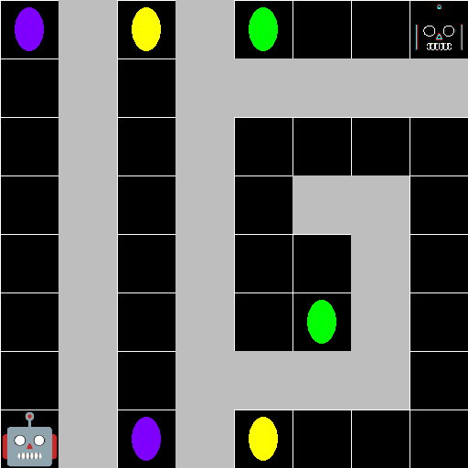
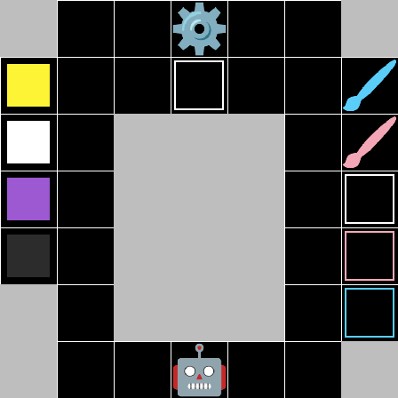
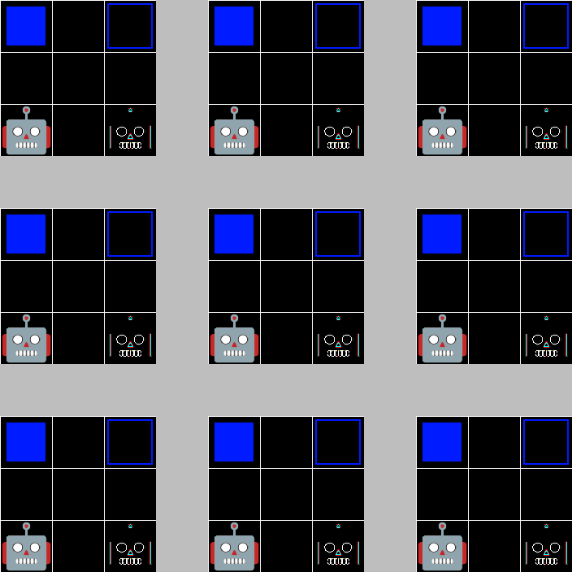

# Отчет по лабораторной работе 2
## Генералов Даниил, НПИ-01-21, 1032212280

В рамках этой лабораторной работы требовалось реализовать модель задачи и несколько задач для планера STRIPS/PDDL.
В этом отчете я расскажу о том, какую задачу я выбрал, каким образом она реализована, и про архитектуру моего решения.

## Задача
Я выбрал задачу движения по лабиринту, взаимодействуя с особыми сущностями в лабиринте.
Несколько роботов двигаются по сетке ячеек, подбирая и откладывая блоки.
Блоки имеют цвет, и есть определенные ячейки, куда следует положить блоки.

В лабиринте также есть порталы (или телепортаторы).
Если робот стоит на портале, он может зайти в этот портал и оказаться на любом другом портале такого же цвета.
Порталы также можно брать и откладывать, как и блоки, но можно держать только один из них одновременно.

Существуют машины по смене цвета блоков.
Те, которые помечены шестеренкой ⚙, убирают цвет с блока, делая его бесцветным,
а те, которые помечены кисточкой 🖌, назначают свой цвет бесцветному блоку.

Также существуют машины по смене цвета порталов.
Помеченная инструментом 🛠 машина сбрасывает портал в бесцветное состояние,
в котором им нельзя пользоваться.
Помеченная цепочкой 🔗 машина назначает порталу цвет, который он принимает, и теперь его можно использовать, чтобы перемещаться к порталам такого же цвета.

Наконец, есть двери (или ворота), которые помечены замком 🔒.
Через них нельзя пройти, но их можно открыть с помощью блока соответствующего цвета.
Это действие уничтожает блок и дверь, открывая путь.

## Реализация
В описании домена задачи используются следующие 6 типов:

- `location` - какое-то место, где может находиться робот, и которые могут быть связаны
  - `cell` - ячейка сетки лабиринта
- `group` - группа объектов (визуально, цвет этих объектов)
  - `block_group` - цвет блоков, имеет название вида `^bgroup_[a-z0-9]+$`
  - `teleport_group` - цвет порталов, имеет название вида `^tgroup_[a-z0-9]+$`
- `robot` - один из роботов в лабиринте

Также существуют две константы -- объекта, которые существуют всегда:

- `bgroup_colorless` - цвет тех блоков, которые не имеют цвета (отображается как белый)
- `tgroup_unpaired` - цвет тех порталов, которые не соединены (отображается как белый овал без заливки)

Состояние всех объектов в лабиринте описывается с помощью следующих 15 предикатов:

- `at(robot, location)` - определенный робот находится в данном месте
- `adjacent(location, location)` - два места являются соседними, т.е. можно переместиться из одного в другое
- `walkable(location)` - робот может находиться в данном месте
- `block_at(location, block_group)` - блок с данным цветом находится в данном месте
- `block_target_at(location, block_group)` - в этом месте должен оказаться блок с данным цветом
- `teleporter_at(location, teleport_group)` - портал с данным цветом находится в данном месте
- `item_at(location)` - на данном месте находится предмет (блок, портал или механизм), и на это место нельзя класть еще один предмет
- `holding_item(robot)` - робот держит предмет в руках, и не может взять еще один
- `holding_block(robot, block_group)` - робот держит блок с данным цветом
- `holding_tp(robot, teleport_group)` - робот держит портал с данным цветом
- `color_remover_machine_at(location)` - на данном месте находится механизм, который удаляет цвет с блока
- `color_assigner_machine_at(location, block_group)` - на данном месте находится механизм, который назначает цвет безцветному блоку
- `teleport_unpairer_at(location)` - на данном месте находится механизм, который удаляет настройку портала
- `teleport_pairer_at(location, teleport_group)` - на данном месте находится механизм, который настраивает портал на данный цвет
- `gate_at(location, block_group)` - на данном месте находится ворота, которые открываются блоком с данным цветом

Программа-планировщик должна найти способ настроить эти предикаты в целевые состояния, используя следующие 11 действий:

- `move(robot, from, to)` - если робот находится в месте `from`, и `from` рядом с `to`, и `to` - место, где можно ходить, то робот перемещается в место `to`
- `use_teleporter(robot, from, to, group)` - если робот сейчас стоит в месте `from`, и на этом месте есть портал, цвет которого соответствует цвету портала в `to`, и этот цвет не равен `tgroup_unpaired`, то робот перемещается в место `to`
- `pick_up_block(robot, where, block_group)` - если робот стоит на месте `where`, и на этом месте есть блок с цветом `block_group`, и робот не держит ничего, то робот поднимает этот блок
- `drop_block(robot, where, block_group)` - если робот стоит на месте `where`, где не лежит никаких предметов и робот держит блок с цветом `block_group`, то робот кладет этот блок на место `where`
- `pick_up_tp(robot, where, tp_group)` - если робот стоит на месте `where`, и на этом месте есть портал с цветом `tp_group`, и робот не держит ничего, то робот поднимает этот портал
- `drop_tp(robot, where, tp_group)` - если робот стоит на месте `where`, где не лежит никаких предметов и робот держит портал с цветом `tp_group`, то робот кладет этот портал на место `where`
- `use_color_remover_machine(robot, where, block_group)` - если робот стоит на месте `where`, и на этом месте есть механизм, который удаляет цвет у блоков, то робот перестает держать блок цвета `block_group`; этот блок становится цвета `bgroup_colorless`
- `use_color_assigner_machine(robot, where, block_group)` - если робот стоит на месте `where`, у него в руках блок цвета `bgroup_colorless`, и на этом месте есть механизм, который присваивает блокам цвет `block_group`, то робот перестает держать блок цвета `bgroup_colorless` и теперь держит блок цвета `block_group`
- `unpair_tp(robot, where, tp_group)` - если робот стоит на месте `where`, у него в руках портал цвета `tp_group`, и на этом месте есть механизм, который разрывает пары порталов, то робот перестает держать портал цвета `tp_group` и теперь держит портал цвета `tgroup_unpaired`
- `pair_tp(robot, where, tp_group)` - если робот стоит на месте `where`, у него в руках портал цвета `tgroup_unpaired`, и на этом месте есть механизм, который устанавливает соединение порталов, то робот перестает держать портал цвета `tgroup_unpaired` и теперь держит портал цвета `tp_group`
- `unlock_gate(robot, from_where, to_where, block_group)` - если робот стоит на месте `from_where`, у него в руках блок цвета `block_group`, а рядом с ним, в месте `to_where`, есть дверь, которая имеет тот же самый цвет, то робот перестает держать блок цвета `block_group`, дверь пропадает, а то место, где стояла дверь, теперь проходимо

Используя эти правила, можно решать одну из придуманых мною 10 задач, или добавлять свои:

- `simple_maze`: робот должен пройти через лабиринт, несколько раз телепортируясь, и попасть в целевую точку
- `simple_move`: два блока стоят на месте друг друга, и робот должен поменять их местами, а затем вернуться к началу
- `portal_move_test`: робот должен положить блоки в комнату, в которую можно попасть только через портал, а портал находится очень далеко от блоков; роботу стоит взять портал с собой и положить его рядом с блоками для скорости
- `color_remove_test`: есть четыре места, где нужно расположить блоки, и есть четыре блока, но блоки цветные, а нужно положить белые; роботу нужно сначала очистить их цвет, а затем положить в нужные места
- `color_trans_test`: есть несколько блоков, но их цвета не соответствуют целевым цветам; нужно сначала очистить их цвета, покрасить их, а затем разместить в целях
- `portal_trans_test`: есть две комнаты, в которых есть полезные блоки, и в каждой из них есть портал, но у робота есть доступ только к одному порталу, и он бесполезный; нужно очистить этот портал, а затем настроить его на две комнаты поочередно и вынести из них нужные блоки
- `gate_test` - путь к цели преграждают несколько дверей; нужно разблокировать каждую, создав блоки нужных цветов на каждом шаге
- `multi_simple_maze` - робот хочет пройти через тот же самый лабиринт, что и в начале, но теперь в конце есть другой робот, который идет в противоположном направлении; два робота могут помочь друг другу добраться до цели быстрее
- `multi_transfer_blocks` - два робота находятся в двух комнатах, между которыми связь только через промежуточную комнату; роботы должны передать блок из одной комнаты в другую, перекрасить его, вернуться обратно и положить в нужное место
- `multi_duplicated` - 9 роботов находятся в 9 одинаковых комнатах с одинаковыми предметами и целью переместить блок в нужное место; они могут либо все делать синхронно, либо последовательно

## Архитектура

Используя PDDL, довольно сложно описывать координатные сетки --
для каждой ячейки нужно прописать 4 предиката, связывающие ее с соседними ячейками.
Для того, чтобы это упростить, задание описывается не как PDDL,
а в промежуточном представлении в JSON.
Например, задача `simple_maze` описывается следующим образом:

```json
{
    "chart":[
        "TxAxF..E",
        ".x.xxxxx",
        ".x.x....",
        ".x.x.xx.",
        ".x.x..x.",
        ".x.x.Fx.",
        ".x.xxxx.",
        "SxTxA..."
    ],
    "tile_types": {
        ".": ["walk"],
        "S": ["start-a", "walk"],
        "E": ["end-a", "walk"],
        "T": ["teleport-group-T", "walk"],
        "A": ["teleport-group-A", "walk"],
        "F": ["teleport-group-F", "walk"],
        "x": ["wall"]
    },
    "fps": 5,
    "colors": {
        "teleport-t": [128, 0, 255],
        "teleport-a": [255, 255, 0],
        "teleport-f": [0, 255, 0]
    }
}
```

В ключе `chart` задается сетка карты, где каждый символ -- это тип ячейки.
В ключе `tile_types` обозначается, что значат эти символы и какие аттрибуты есть у них:
например, `.` -- это пустая ячейка, которую можно пройти, `x` -- это стена, которую нельзя пройти, а `T`, `A`, `F` -- это телепорты, которые связаны друг с другом.

После того, как задание описано в JSON, его можно преобразовать в PDDL.
Это делается с помощью программы `make-pddl.py`.
В этой программе задана логика задания всех предикатов и объектов от состояния карты.
Эта программа заменяет определенные строки в файле-образце, `maze-template.pddl`.
(Файл описания домена, `domain.pddl`, также образуется с помощью этой программы,
потому что раньше я использовал самописные целые числа, образуемые с помощью предикатов
`succ(N, N+1)` и `adds(N, M, N+M)` --
для того, чтобы это работало, необходимо описать объекты чисел в домене.)

После того, как образован PDDL, его можно решить.
Большинство задач решаются с помощью планировщика FF, но некоторые бывает быстрее с помощью Fast Downward.
Два ключа в Makefile, `env-solve` и `env-solve-sas`, запускают это решение.
Это должно происходить в окружении, где эти программы установлены;
такое окружение предоставляет контейнер Planutils, который можно запустить с помощью `make env`.

Поскольку работают два разных планировщика, у которых есть разные форматы выходных данных,
то есть программа, которая преобразует вывод от FF в формат от Fast Downward;
так сложилось, что я использую последний в дальнейшей обработке.
Эта программа называется `ff_plan_converter.py`.

Чтобы упростить процесс запуска одного файла (JSON -> PDDL -> решение -> обработка),
программа `make-many-plans.py` делает все шаги, которые не требуют доступа к утилитам планировщика, автоматически,
а планировщик запускается одной командой, которую можно копировать.

В JSON задания ключи `fps` и `colors` не влияют на PDDL, но используются для настройки визуализации.
Этим занимается программа `visualizer.py`, которая принимает как аргумент название задачи.
С помощью Pygame отображаются шаги, которые выполняет робот.
Вывод можно увидеть на экране или сохранить как последовательность картинок и превратить в GIF-анимацию.






