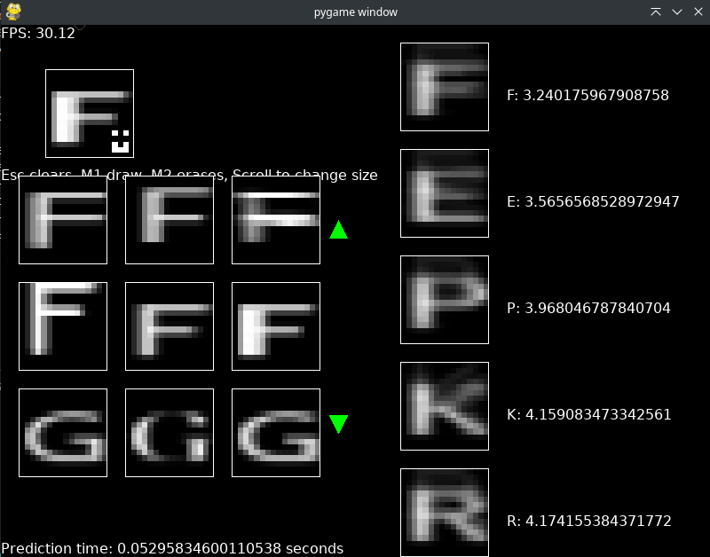

# Отчет по лабораторной работе 3
## Генералов Даниил, НПИ-01-21, 1032212280

В рамках этой лабораторной работы требовалось реализовать алгоритм классификации изображений.
В этом отчете я расскажу о том, как именно реализована программа, которая выполняет эту задачу.

В соответствии с требованием, что вычисление должно быть написано на C++, методы, в которых выполняется математика,
описаны в файле `calc.cpp`.
Среди них `compute_kernel`, `invert_matrix`, `compute_covariance_matrix` и `compute_mahalanobis_distance`.

Метод `compute_kernel` принимает массив векторов-объектов и возвращает вектор-ядро класса.
Метод `compute_covariance_matrix` принимает массив векторов-объектов и ядро класса и возвращает матрицу ковариации.
Метод `invert_matrix` заменяет матрицу на обратную ей.
Вместе, эти методы создают данные, которые необходимы для вычисления расстояния Махаланобиса -- этим занимается метод `compute_mahalanobis_distance`.

С помощью этих методов можно расчитать расстояние от каждого вектора-объекта (входного изображения) до каждого класса.
После этого можно отсортировать расстояния и определить, к какому классу относится входное изображение.
Это все сравнительно высокоуровневые операции,
поэтому они выполняются в коде на высокоуровневом языке -- Python.

Для отображения данных на экран используется библиотека `pygame`; с помощью нее же и создаются исходные данные.
В файле `dataset.py` используется функционал Pygame для работы с шрифтами, чтобы отобразить несколько символов.
Эти символы затем масштабируются на размер одного вектора.

После этого нужно посчитать ядра классов и матрицы ковариации.
Для этого нужно сначала преобразовать данные в формат, который ожидает C++ код, а затем его вызвать.
Это выполняется в файле `extern_calc.py`.
Все методы, которые начинаются на слово `extern_` -- это обертки над вызовами C++ кода, выполненные с помощью `ctypes`;
например, `extern_class_into_covariance` вызывает `compute_covariance_matrix`, передавая данные о классе объектов, и возвращает матрицу ковариации для этого класса.

В файле `ui.py` описано, как работает интерфейс, который запускается при запуске программы.
Сначала считаются все ядра и матрицы ковариации, отображая прогресс на экране.
После этого появляется окно, где есть поле для рисунка, список распознанных классов и список символов в датасете.
В поле для рисунка можно добавлять пиксели левой кнопкой мыши или удалять их правой кнопкой мыши.
Колесо мыши можно использовать для изменения размера кисти.
Если же щелкнуть на любом из существующих рисунков, то он будет загружен в окно для рисования, и его можно там изменить.

